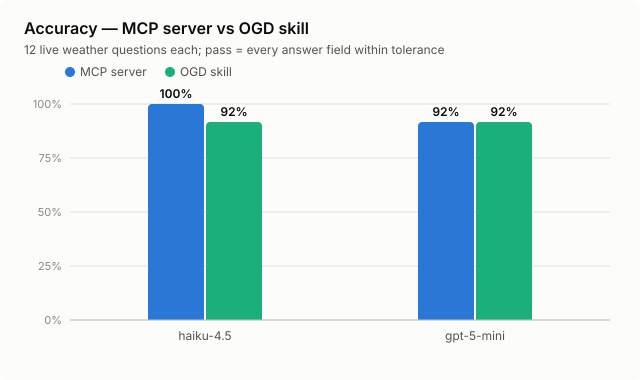
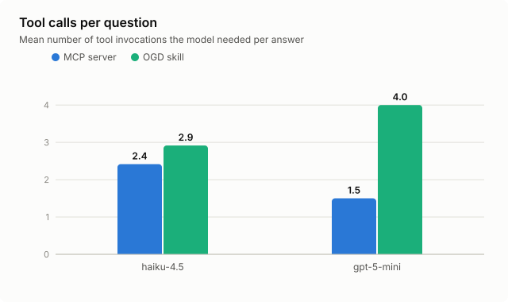
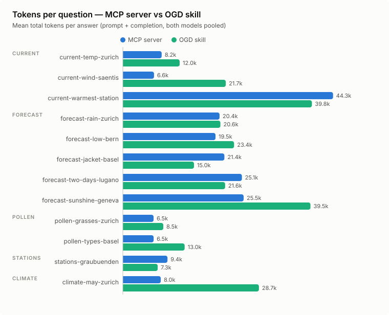
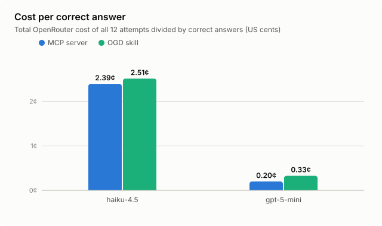

# MCP server or skill? Racing two ways to answer Swiss weather questions

*2026-07-12 · [meteoswiss-llm-tools](https://github.com/eins78/meteoswiss-llm-tools) · eval run on live MeteoSwiss open data*

This repo ships the same weather capability twice: an [MCP server](../../../meteoswiss-mcp/)
with seven structured tools, and an [agent skill](../../../meteoswiss-skills/skills/meteoswiss-ogd/)
that teaches a model to fetch the raw open-data CSVs itself with `curl` and `awk`. The
[parity lint](../../../../docs/plans/2026-07-11-skills-mcp-parity.md) keeps their *coverage*
identical — but which one answers real questions better, and what does each cost in tokens?

We raced them. Twelve real-world questions ("Will it rain in Zürich on Monday afternoon?",
"How windy is it on Säntis right now?", "Name three weather stations in Graubünden"), two
cheap models (claude-haiku-4.5 and gpt-5-mini), both access methods, live data, and
programmatic grading against ground truth captured minutes before each run. 48 answers,
$0.62 of OpenRouter spend for the published sweep.

## Headline: structure wins on accuracy, and it's not the token hog you'd expect



| method | accuracy | mean tokens/question | total cost (24 answers) |
| ------ | ----------- | ------------- | ---------- |
| MCP server | 96% (23/24) | 16,774 | $0.31 |
| OGD skill | 92% (22/24) | 20,931 | $0.31 |

The MCP server answered 96% of questions correctly against the skill's 92%, and
haiku-4.5 went a perfect 12/12 on MCP. The common assumption says MCP pays for that
with tokens: its `tools/list` schemas plus verbose JSON results should dwarf the skill's
compact CSVs. The sweep says otherwise: **the MCP method used ~20% fewer tokens per
question overall**, because round trips dominate payload size. One `meteoswissClimateData`
call returns named, filtered JSON; the skill's raw-CSV route spent 3.5× the tokens
navigating a 30-column CSV to the same number.

## Round trips are the real currency



gpt-5-mini needed 1.5 tool calls per answer via MCP and 4.0 via the skill. Every extra
round trip re-sends the whole growing conversation, so chatty flows compound: the skill's
individually small `curl` outputs lose to MCP's single fat JSON response once the model
needs three or four of them. The skill's bundled scripts (`current-weather.sh`,
`forecast.sh`) are the exception that proves the rule: where models used them directly,
skill runs were *cheaper* than MCP (station search: 7.3k vs 9.4k tokens).



Per family, the token ratio (MCP ÷ skill) tells the story of where each shines:

| family | MCP accuracy | skill accuracy | MCP÷skill tokens |
| -------- | ------------ | ---------- | ---------------- |
| current | 83% (5/6) | 100% (6/6) | 0.80 |
| forecast | 100% (10/10) | 90% (9/10) | 0.93 |
| pollen | 100% (4/4) | 75% (3/4) | 0.60 |
| stations | 100% (2/2) | 100% (2/2) | 1.28 |
| climate | 100% (2/2) | 100% (2/2) | 0.28 |

## What each method gets wrong

Three answers failed in the published sweep, and they map cleanly to each method's blind
spot:

- MCP lacks a "scan everything" tool. "Which station is warmest right now?" needs
  every station's current temperature. The skill's `awk` one-liner over the full CSV
  nailed it both times; `meteoswissCurrentWeather` returns one station per call, and
  gpt-5-mini gave up after probing a few guesses. haiku brute-forced its way through
  and passed, at 79k tokens across 13 tool calls the most expensive answer in the
  whole sweep.
- Raw CSVs are a column-confusion minefield. Asked which pollen types Basel currently
  measures, haiku-via-skill read the stale `d0` column instead of the recommended `d1`
  and reported hazel that isn't there. MCP's named JSON fields (`"type": "Hazel
  (Corylus)", "value": 0`) make that mistake structurally impossible. Earlier sweeps
  showed the same failure shape on climate data: a model read `ths2dymn` (mean daily
  minimum) instead of `ths200m0` (monthly mean) from the 30-column NBCN file.
- Shell state doesn't persist. gpt-5-mini-via-skill stored an asset URL in a shell
  variable, then referenced it in the next tool call, where it no longer existed, and
  burned its remaining turns on empty `curl` errors. That is faithful to real agent
  shells (Claude Code's Bash resets env between calls too), and a genuine failure mode
  structured tools simply don't have.

## Cost per correct answer: the model dwarfs the method



Both methods cost almost exactly the same in dollars ($0.31 for 24 answers each). The
gap that matters is the model: gpt-5-mini delivered correct answers at 0.20¢ (MCP) /
0.33¢ (skill) each, haiku-4.5 at 2.39¢ / 2.51¢ — a 10× spread from model pricing against
a ~1.2× spread from access method. Pick the access method for reliability and operational
fit; pick the model for cost.

## Bonus: the eval found (and fixed) a real skill bug

The first sweep failed every skill forecast question. Root cause: MeteoSwiss publishes
each day's STAC item *before* uploading its assets, so just after midnight the skill's
documented "take the latest item" flow — and its bundled `forecast.sh` — selected an
empty item and returned `no_data` for every parameter. The MCP server already handled
this. Both the skill doc and the script now skip asset-less items
([changeset](../../../../.changeset/mcp-vs-skills-eval-fixes.md)). That's the eval
earning its keep: live-data evals catch integration rot that fixtures never see.

## Takeaways

- Default to the MCP server when it's available: higher accuracy, fewer round trips,
  and, against intuition, fewer tokens on average. Name resolution alone
  ("Zürich" → SMA, "Basel" → PBS) prevents a whole class of wrong-station errors.
- Skills win where flexibility beats structure: whole-dataset scans the server has
  no tool for, environments where you can't run a server, and workflows the bundled
  scripts cover (those were the cheapest answers in the sweep).
- Add an MCP tool for cross-station queries. The one MCP failure was structural,
  not a model mistake: nothing in the tool surface answers "compare all stations".
- Round trips cost more than payloads. If you design either surface, optimize for
  answer-in-one-call, not for small individual responses.

## Methodology

- Harness: promptfoo custom providers
  ([`src/mcp-vs-skills/`](../../src/mcp-vs-skills/)) run an OpenRouter tool-calling
  agent loop (temperature 0, max 8 turns). The MCP provider connects to a local
  `meteoswiss-mcp` over Streamable HTTP and forwards its real `tools/list` schemas; the
  skill provider injects the SKILL.md body plus one guarded `bash` tool (allowlisted
  read-only commands, MeteoSwiss-hosts-only URLs, 10 KB output cap — mirroring Claude
  Code's truncation).
- Ground truth is captured minutes before each run: current weather, pollen,
  climate, and station names parsed directly from the OGD CSVs by independent eval
  code; forecasts via the MCP server (re-implementing its DST-aware hourly bucketing
  would duplicate the code under test — a documented trade-off). Scoring is
  programmatic with per-question tolerances (e.g. ±1.5 °C on live temperature) since
  measurements refresh every 10 minutes.
- Tokens and cost come from OpenRouter's own per-call `usage` accounting, summed
  across loop iterations. Prompt tokens count the growing conversation on every turn —
  that's what you actually pay. A hard budget guard aborts the run at $4.
- Limitations: 12 questions × 2 models is a small sample; single sweep per
  configuration (three sweeps were run while shaking out harness bugs — accuracy moved
  by exactly one answer between the last two); the bash sandbox rejected a handful of
  legitimate commands in earlier sweeps (`|| true`, comments with apostrophes) which we
  fixed before the published run; grading tolerates rounding, so "correct" means
  "within tolerance of ground truth", not bit-identical.

Reproduce:

```bash
cd packages/meteoswiss-forecast-evals
pnpm install
pnpm run mcp-skills:eval        # captures ground truth, runs the sweep (~$0.65)
pnpm run mcp-skills:summarize   # tables
pnpm run mcp-skills:charts      # SVGs
```
